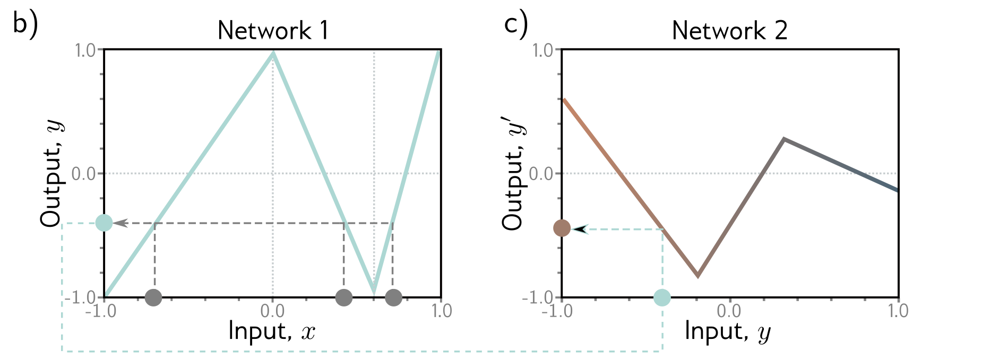
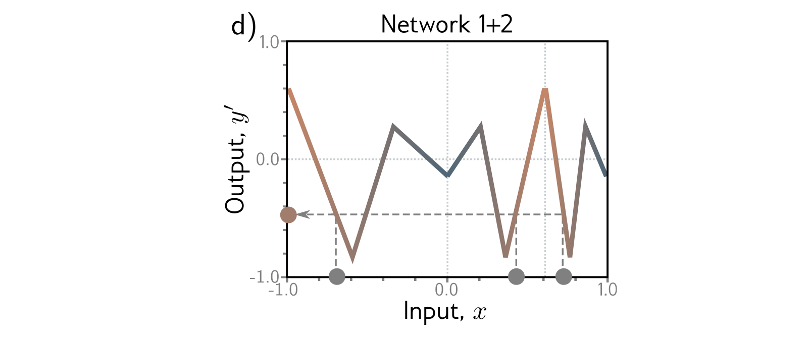
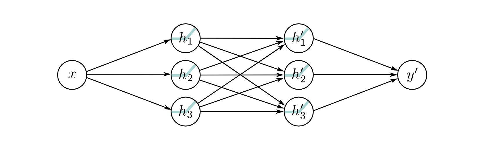
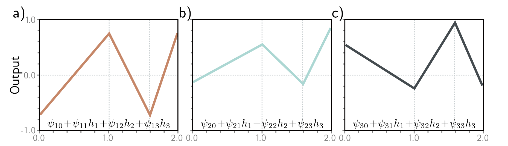
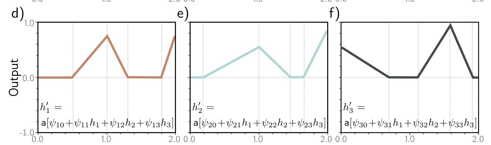
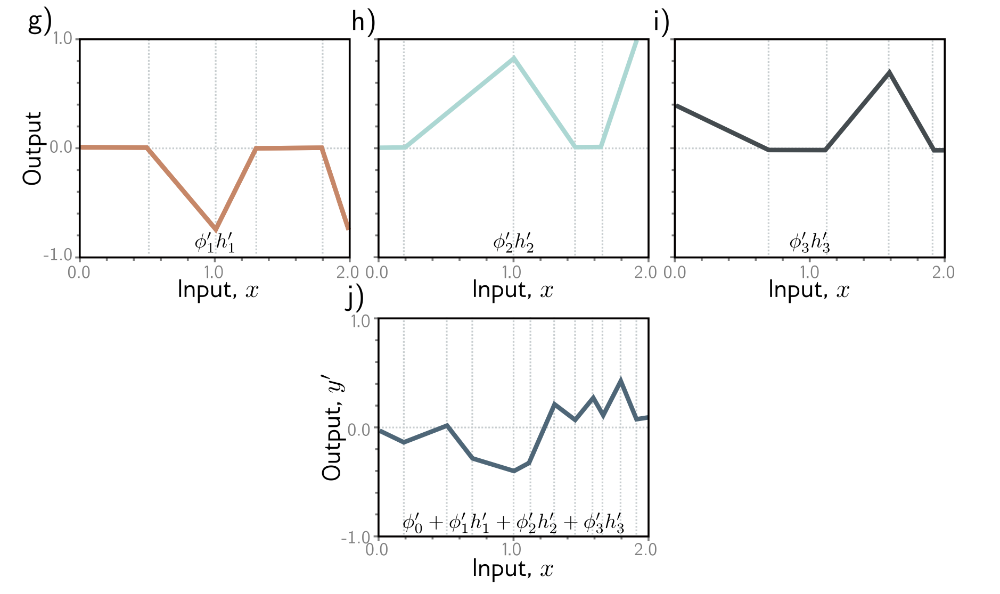

In this post, I will extend the idea of interpreting shallow neural networks as piecewise linear functions to deep neural networks. This post is based on chapter 4 of the [Understanding Deep Learning](https://udlbook.github.io/udlbook/) textbook.

## Composing two shallow neural networks
Before looking into deep neural networks, let's look at composing two shallow neural networks and see how the composition impacts the linear regions that are formed. Let's define the first neural network that takes an input $x$ and returns an output $y$ by:

$$h_1 = a[\theta_{10} + \theta_{11}x]$$
$$h_2 = a[\theta_{20} + \theta_{21}x]$$
$$h_3 = a[\theta_{30} + \theta_{31}x]$$ 			    

and   
			    
$$y = \phi_0 + \phi_1 h_1 + \phi_2 h_2 + \phi_3 h_3$$

The second network takes $y$ , the output of previous network, as the input and produces $y'$ and is defined by

$$h_1^\prime = a[\theta_{10}^\prime + \theta_{11}^\prime x]$$

$$h_2^\prime = a[\theta_{20}^\prime + \theta_{21}^\prime x]$$

$$h_3^\prime = a[\theta_{30}^\prime + \theta_{31}^\prime x]$$			    

and
			    
$$y^\prime = \phi_0^\prime + \phi_1^\prime h_1^\prime + \phi_2^\prime h_2^\prime + \phi_3^\prime h_3^\prime$$

As described in the previous post, with ReLU activation functions, these networks can also be interpreted as piecewise linear functions as follows.
  
The first network maps $x \in [-1, 1]$ to outputs $y \in [-1, 1]$ and since there are three hidden units, there are three linear regions. Also notice that multiple inputs $x$ can map to the same output $y$ for this function. This means that three different ranges of $x$ are mapped to the same output range $y$ . Similarly, the second network is also defined by three linear regions as shown. When we combine these two networks, the composed network will be defined by nine linear regions as shown below.
  

## Composition as a special case of deep neural networks
Composition of two neural networks is a special case of a deep neural network with two layers. We can expand the equations for the second neural network as follows:

$$h^\prime_1 = a[\theta^\prime_{10} + \theta^\prime_{11}x] = a[\theta^\prime_{10} + \theta^\prime_{11} \phi_0 + \theta^\prime_{11} \phi_1 h_1 + \theta^\prime_{11} \phi_2 h_2 + \theta^\prime_{11} \phi_3 h_3 ]$$

$$h^\prime_2 = a[\theta^\prime_{20} + \theta^\prime_{21}x] = a[\theta^\prime_{20} + \theta^\prime_{21} \phi_0 + \theta^\prime_{21} \phi_1 h_1 + \theta^\prime_{21} \phi_2 h_2 + \theta^\prime_{21} \phi_3 h_3 ]$$

$$h^\prime_3 = a[\theta^\prime_{30} + \theta^\prime_{31}x] = a[\theta^\prime_{30} + \theta^\prime_{31} \phi_0 + \theta^\prime_{31} \phi_1 h_1 + \theta^\prime_{31} \phi_2 h_2 + \theta^\prime_{31} \phi_3 h_3 ]$$

Let's rewrite this as

$$h^\prime_1 = a[\psi_{10} + \psi_{11} h_1 + \psi_{12} h_2 + \psi_{13} h_3]$$

$$h^\prime_2 = a[\psi_{20} + \psi_{21} h_1 + \psi_{22} h_2 + \psi_{23} h_3]$$

$$h^\prime_3 = a[\psi_{30} + \psi_{31} h_1 + \psi_{32} h_2 + \psi_{33} h_3 $$ 		    

The result is a network with two hidden layers. Therefore, it follows that a network with two layers can represent a family of functions created by passing the output of one single-layer network onto another.  
  
		    
However, a network with two layers represent a much broader family of functions. For the special case where a two layered network represents a composition of two neural networks, the parameters $\psi$ s take the value of $[\theta^\prime_{11}, \theta^\prime_{21}, \theta^\prime_{31}]^T[\phi_1, \phi_2, \phi_3]$ .  

## Deep neural networks

Now consider the general case of a deep neural network with two hidden layers, each containing three hidden units each. The first layer is defined by:  

$$h_1 = a[\theta_{10} + \theta_{11}x]$$

$$h_2 = a[\theta_{20} + \theta_{21}x]$$

$$h_3 = a[\theta_{30} + \theta_{31}x]$$ 		    

the second layer by:

$$h^\prime_1 = a[\psi_{10} + \psi_{11} h_1 + \psi_{12} h_2 + \psi_{13} h_3]$$

$$h^\prime_2 = a[\psi_{20} + \psi_{21} h_1 + \psi_{22} h_2 + \psi_{23} h_3]$$

$$h^\prime_3 = a[\psi_{30} + \psi_{31} h_1 + \psi_{32} h_2 + \psi_{33} h_3]$$ 		    

and the output by:  

$$y^\prime = \phi^\prime_0 + \phi^\prime_1 h^\prime_1 + \phi^\prime_2 h^\prime_2 + \phi^\prime_3 h^\prime_3$$

Considering these equations leads to another way to think about how a neural network constructs an increasingly complicated function
- The three hidden units in the first layer, $h_1, h_2, h_3$ are computed as usual by linear functions of input and passing these through ReLU activation functions as shown below:
      
- The pre-activations at the second layer are computed by taking three new linear functions of these hidden units. At this point, we effectively have a shallow neural network with three outputs
- At the second hidden layer, another ReLU function is applied to each function, which clips and adds new "joints" to each.
      
- The final output is a linear combination of these hidden units
      

We can think of each layer as creating new input functions, which are clipped (creating new regions) and then recombined.

We can extend the same idea of interpreting shallow neural networks as piecewise linear functions into the realm of deeper networks. I show an example using a simple two-layer network here. However, in practice, deep neural network has many more than two layers.

