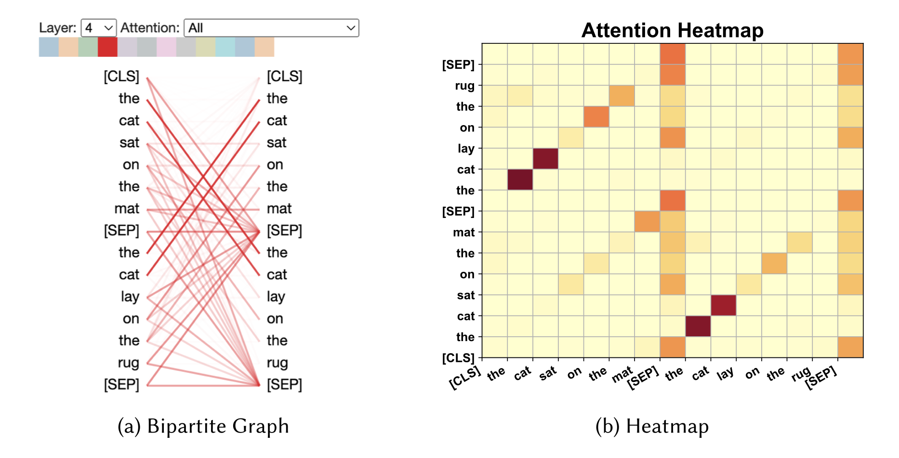

## Why care about explainability?

Explaining why Large Language Models (LLMs) make a certain prediction is difficult. This is because LLMs are very complex "black box" models, i.e. their inner working mechanisms are opaque. However, there are mainly two reasons why we need to develop methods for explaining LLM predictions:
1. For end users of the models, explaining a model's predictions will help understand the reasoning behind a certain prediction, which can help build trust in the system they are using. For example, if an LLM is used the medical domain to detect a certain disease, the medical practitioners would need to understand the reasoning behind the predictions to verify the accuracy.

2. For developers of these complex systems, explaining the predictions will help them understand the model's biases, risks and improve the wrong predictions. In other words, explainability aids in debugging these black boxes.

Many techniques have been developed for explaining LLM predictions. We can categorise these techniques based on how these models are trained. One way to train an LLM is by using the traditional fine-tuning technique, where, the LLM is first pre-trained on a large corpus of unlabelled text data, and then fine-tuned on a smaller labelled dataset. For example, during their pre-training stage, protein LLMs are first trained on an unlabelled dataset of millions of protein sequences. Later, these models are then fine-tuned on smaller task specific datasets, which may contain a few thousand samples. The second way to train an LLM involves the use of prompts. The models are trained in a zero-shot or few-shot manner using, for example, masked natural language sentences for the model to fill in. In this blog post, we will look at some techniques for LLM explainability for the traditional fine-tuning paradigm. Specifically, we will focus on techniques that generate local explanations for LLM predictions.

A local explanation aims at providing an understanding of how a language model makes a prediction for one sample. In contrast, a global explanation tries to provide a provide a broad understanding of how the LLM works overall. Say, you have a protein language model that classifies a protein sequence into those having a anti-cancerous properties or not. A local explanation of an LLM will give insights into why it classified a certain input protein sequence as positive or negative. A global explanation for this model would involve understanding how the model represents different protein sequences internally. We will look at four main streams of approaches for generating local explanations, which are feature-attribution based explanation, attention-based explanation, example-based explanation and natural language explanation.

## Feature attribution-based explanation
Input features to LLM could be words, phrases or text-spans. Feature attribution based techniques aim at measuring the relevance of each such input feature to a model's prediction. For example, it would be useful to learn how important each word in an LLM's input sequence was to a prediction made by that LLM. There are a few techniques to find the importance of an input feature. One way is to change the input to the model (by removing, masking, or altering features) and evaluating how  the output changes. The basic idea is to change the minimum set of features to change the model's prediction. Then, these minimal set of input features can be considered the most important ones.

Gradient-based techniques for feature attribution determines feature importance by analysing the gradient of the output with respect to each input dimension. Higher the magnitude of the gradient, more sensitive the model's prediction is to that feature. One can also use simpler *glass box* models like decision trees and linear models to explain the LLM predictions. Popular techniques like LIME and SHAP can be used. To adapt SHAP to transformer-based models, approaches like TransSHAP has also been proposed.

## Attention-based explanation

Attention mechanism in a transformer enables it to attend to the most important relevant parts of inputs. Thus, there are many approaches that solely rely on the attention weights to explain the predictions made by a model.  An intuitive way to understand the patterns in attention is to visualise them. Common techniques for visualising attention heads for a single input sequence include using heatmaps or bi-partite graphs.
      
    Attention can be visualised at different scales. At the input data level, in addition to looking at the attention between word pairs, one can also visualise attention at the token and sentence levels. Individual attention heads can be inspected to understand the model behaviour, and attention across heads and layers can also be visualised to identify patterns. In addition to visualising raw attention values, gradients of outputs with respect to attention scores are used to explain model predictions. In general, techniques that combine attention scores and the gradients perform better than either one alone.

Importantly, there is an active debate in the academic community over using attention values for explaining a model's predictions. Some analyses have found that features determined as important using attention scores does not align with the ones identified using other techniques like LIME. Some also argue that attention fails to capture syntactic structures in text and may not contribute to the prediction of a model as widely assumed.

## Example-based explanation

Example based explanations determines how an model's output changes with different inputs and uses it to explain the model's predictions. One approach uses adversarial examples. One can alter the less important components of an input and see how the model's predictions change. This can reveal if a model is focussing on un-important components in an input while making predictions. Counterfactual explanations on the other hand, involves generating inputs to a model by manipulating significant parts of the input data and thus revealing how the model's prediction would change based on these pre-defined change to input. Another way to understand the model's behaviour is by determining the influence of different training samples on the loss on test datapoints.

## Natural language explanation

Natural language explanations for a model's prediction can be generated by training a model to explain it's decision making on a input sequence. A basic approach for generating such explanations involve training a model with using original text input and human generated explanations. The trained language model then automatically generates explanations.

To conclude, gaining insights into how large language models work is crucial for end users who are using these systems, as well as developers who are creating these models. In this post, we looked at four different categories of techniques to generate explanations for a model's predictions. Feature attribution based approaches identify important features in an input sequence, attention based techniques make use of attention weights, while example based explanations tries to find most influential examples in the training set and finally there are approaches to make an LLM itself explain it's reasoning process. I think these different methods for explaining an LLM complement each other. In a future post, I will look into generating global explanations for LLMs as well.

These are my notes from the following paper:

> H. Zhao *et al.*, “Explainability for Large Language Models: A Survey,” *ACM Trans. Intell. Syst. Technol.*, vol. 15, no. 2, p. 20:1-20:38, Feb. 2024, doi: [10.1145/3639372](https://doi.org/10.1145/3639372).  

