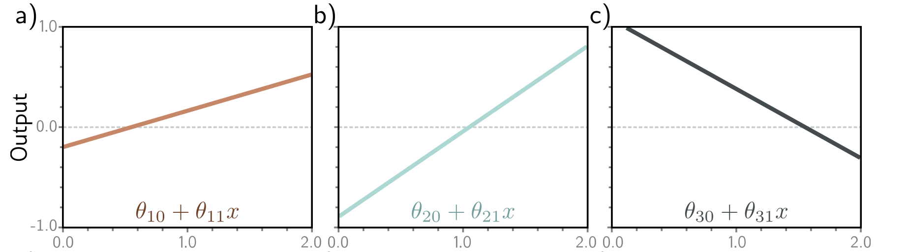
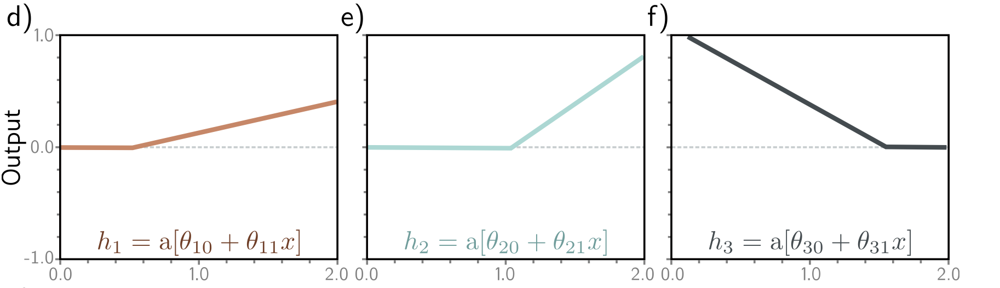
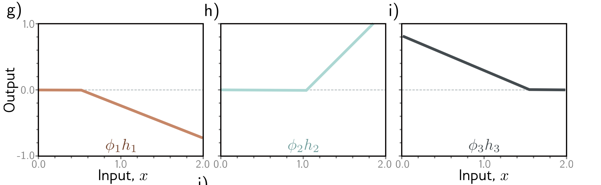

This blogpost is based on my notes from the Shallow neural networks chapter in the book [Understanding Deep Learning](https://udlbook.github.io/udlbook/).

## Defining a simple neural network
Today I learned that a simple shallow neural networks can be thought of as piecewise linear functions.  Consider a simple neural network that maps a single scalar value, $x$ to a single scalar value $y$ , given by
$$y = f[x, \theta]$$

Say this simple network only has 10 parameters, represented by
$$\phi = \{\phi_0, \phi_1, \phi_2, \phi_3, \theta_{10}, \theta_{11}, \theta_{20}, \theta_{21}, \theta_{30}, \theta_{31}\}$$
and the equation  
$$y = \phi_0 + \phi_1 a[\theta_{10} + \theta_{11}x] + \phi_2 a[\theta_{20} + \theta_{21}x] + \phi_3 a[\theta_{30} + \theta_{31}x]$$

This equation has three parts. First, we evaluate three linear functions of the input x, i.e. $\theta_{*0} + \theta_{*1}x$ . Then we pass the outputs of these linear functions through an activation function $a[\cdot]$ and finally, we take a weighted sum of the outputs of the activation function using $\phi_1, \phi_2, \phi_3$ as weights and add an offset $\phi_0$ .

A common choice for the activation function is the Rectified Linear Unit (ReLU) function. ReLU clips the negative values in it's input to zero.
    

## Thinking about the parameters
We can see that $f[x, \phi]$ represents a family of functions where each member in the family is defined by an element in the set of parameters $\phi$ . If we know these parameters, we can calculate the value of $y$ for any input $x$ by evaluating the function $f[x, \phi]$ . However, how can we find the parameters $\phi$ ?.

Given a training dataset, which contains the pairs of values for $x$ and $y$ , say $\{x_i, y_i\}_{i=1}^I$ , we can define a least squares loss function $L(\phi)$ and use this to measure how effectively $f$ estimates the training dataset. Once we have this function to measure this loss, we can find the optimal set of parameters $\hat{\phi}$ that minimises this loss.

## But, where is the piecewise linear function?
The function $f[x, \phi]$ defines a piecewise linear function with upto 4 linear regions. To understand this, let us refactor the equation a bit. First, let's calculate these values $h_1, h_2, h_3$ , which we will call hidden units.
$$h_1 = a[\theta_{10} + \theta_{11} x]$$ $$h_2 = a[\theta_{20} + \theta_{21} x]$$ $$h_3 = a[\theta_{30} + \theta_{31} x]$$  Now, we can compute the output of $f[x, \theta]$ by computing a weighted sum of these hidden units  
$$y = \phi_0 + \phi_1 h_1 + \phi_2 h_2 + \phi_3 h_3$$  
  Let's visualize this function to see how this is a piecewise linear function. To start with, the plots below represents the first step in this equation, where we calculate a linear function of the inputs, i.e. $\theta_{*0} + \theta_{*1}x$ .  
    

The second step in calculating this equation is to apply the ReLU activation function to these outputs, which will clip the negative values to zero. These will be outputs of the hidden units:
    
Now, let's perform the weighted sum using the parameters $\phi_*$
    
Finally, we can add all these individual pieces together with an offset to produce the final function as shown below:
    

We can see that the final function turns out to be a piecewise linear function with four segments. Each segment's slope is determined by the slope of the corresponding segment of the inputs that are active and the parameters $\phi_*$ these sections are scaled by. For example, in the shaded region, input 2 is not active, this it's slope is determined only by inputs 1 and 3.

Each hidden unit contributes one joint to the final function. So, with three hidden units there are four linear sections. However, only three of these sections are independent, since the fourth one is either zero or a function of the other three.

In today's post, we saw how a simple neural network with one scalar input and one scalar output can be thought of as a piecewise linear function. The number of linear segments is determined by the number of hidden layers and the parameters they are weighted by. This idea can be extended to deeper neural network, but that's for another day.